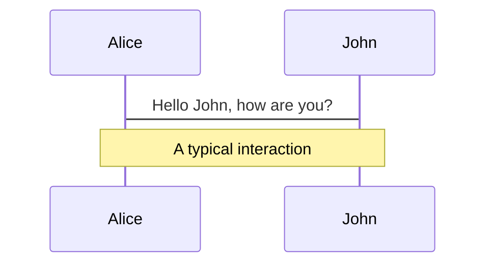
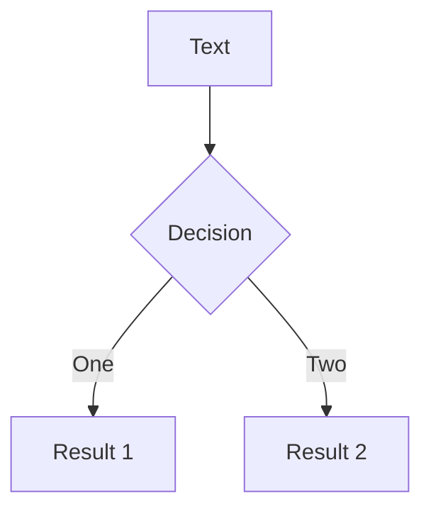
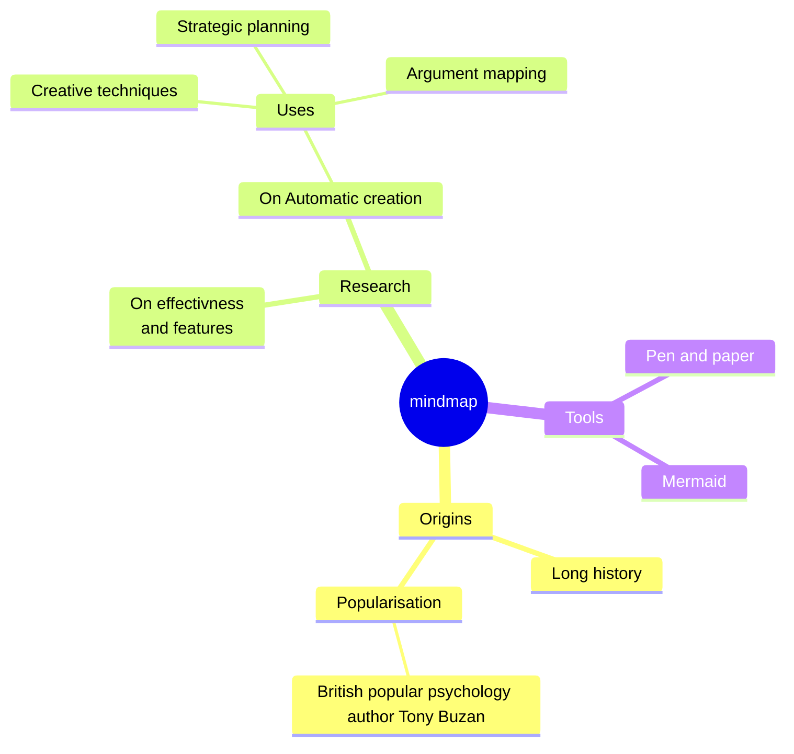
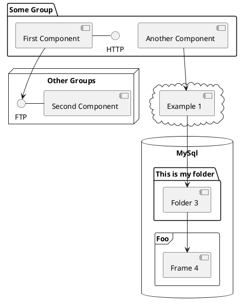

---
# try also 'default' to start simple
theme: seriph
# random image from a curated Unsplash collection by Anthony
# like them? see https://unsplash.com/collections/94734566/slidev
background: https://source.unsplash.com/collection/94734566/1920x1080
# apply any windi css classes to the current slide
class: 'text-center'
# https://sli.dev/custom/highlighters.html
highlighter: shiki
# show line numbers in code blocks
lineNumbers: false
# some information about the slides, markdown enabled
info: |
  ## Slidev Starter Template
  Presentation slides for developers.

  Learn more at [Sli.dev](https://sli.dev)
# persist drawings in exports and build
drawings:
  persist: false
# page transition
transition: slide-left
# use UnoCSS
css: unocss
---

# 记分牌

如何写一个记分牌仿真器

如何写一个像记分牌一样的单发射流水线调度算法


---
transition: fade-out
---

# 虚拟机器？

现代计算机是被ISA定义的，由所有支持的指令定义

- 15个寄存器R[0:15]
- 指令 ADD、SUB、MUL、DIV
- 运算器有一个加法单元、一个乘法单元、一个除法单元
- 单发射流水线
- 除执行外发射、读操作数、写回都是一个时钟周期
- LD需要1个周期
- ADD需要2周期
- MUL需要10个周期
- DIV需要40个周期
- 指令格式 OP DST SCR1 [SCR2]
- LD 两个操作数、其余指令三个操作数


<br>
<br>


<style>
h1 {
  background-color: #2B90B6;
  background-image: linear-gradient(45deg, #4EC5D4 10%, #146b8c 20%);
  background-size: 100%;
  -webkit-background-clip: text;
  -moz-background-clip: text;
  -webkit-text-fill-color: transparent;
  -moz-text-fill-color: transparent;
}
</style>

<!--
Here is another comment.
-->

---
layout: default
---

# 我们的机器上面跑什么程序？

```js
LD R6 R2
LD R2 R3
MUL R0 R2 R4
SUB R8 R6 R2
DIV R10 R0 R6
ADD R6 R8 R2
```

```js
LD R6 R2\nLD R2 R3\nMUL R0 R2 R4\nSUB R8 R6 R2\nDIV R10 R0 R6\nADD R6 R8 R2
```

```js
0 LD R6 R2
1 LD R2 R3
2 MUL R0 R2 R4
3 SUB R8 R6 R2
4 DIV R10 R0 R6
5 ADD R6 R8 R2
```

- LD需要1个周期
- ADD需要2周期
- MUL需要10个周期
- DIV需要40个周期
- 指令格式 OP DST SCR1 [SCR2]
- LD 两个操作数、其余指令三个操作数


---
transition: slide-up

level: 2
---

# 流水线循环

- 发射（Issue）读操作数（readOperand）执行（execute）写回（writeback）

```js {all|6|10|11|12|6,10,11,12|all}
let cycle = 0
for(;;) {
  cycle++
  doPendingJobs()
  try {
    issue()
  } catch (error) {
    console.log(error, "程序结束", cycle);
  }
  readOprand()
  execute()
  writeback()
}
```

---

# 代码最后看起来是什么样？

两个文件，一个流水线循环，一个包含四个函数文件

<div grid="~ cols-2 gap-4">
<div>

```js {1-3,5-13}
let cycle = 0
for(;;) {
  cycle++
  doPendingJobs()
  try {
    issue()
  } catch (error) {
    console.log(error, "程序结束", cycle);
  }
  readOprand()
  execute()
  writeback()
}
```
</div>
<div>

```js {4-15}
export function doPendingJobs() {
    //code
}
export function issue() {
    //code
}
export function readOprand() {
    //code
}
export function execute() {
    //code
}
export function writeback(){
    //code
}
```

</div>
</div>

---

# 机器的内部状态

```js {all|1-2|3-9|10|11-16|17-18|all}
export let instructions = []
// 0 初始
// 1 发射
// 2 解码
// 3 执行
// 4 写回
export let istates = new Array(10).fill(0)
export let istatesfinished = new Array(10).fill(0)
// 0 整数单元
// 1 加法和减法单元
// 2 乘法单元
// 3 除法单元
export let functionUnitStates = []
// 下一个将要issue的指令
let next = 0;
let result = []
```

---

# 第一个函数——发射（issue）

```js {all} {'maxHeight': '400px'}
export function issue() {
    if (istates
        .filter(v => v === 4)
        .length === instructions.length) {
        throw Error("程序结束")
    }
    const i = instructions[next]
    if (i === undefined) {
        return
    }
    let [op, dst, src1, src2] = i.split(' ')
    if(result[+dst[1]] !== undefined) {
        return
    }
    switch (op) {
        //整数单元
        case 'LD':
            if (typeof functionUnitStates[0] === 'object'
                 && functionUnitStates[0].busy) {
                return
            }
            functionUnitStates[0] = {
                busy: true,
                op: 'LD',
                src1: src1,
                // dst一定是寄存器，我们直接记录号码0-14
                dst: +dst[1],
            }
            break;
        //乘法单元
        case 'MUL':
            if (typeof functionUnitStates[2] === 'object' && functionUnitStates[2].busy) {
                return
            }
            functionUnitStates[2] = {
                busy: true,
                op: 'MUL',
                src1: src1,
                src2: src2,
                // dst一定是寄存器，我们直接记录号码0-14
                dst: +dst[1],
            }
            break;
        //加法单元
        case 'ADD':
            if (typeof functionUnitStates[1] === 'object' && functionUnitStates[1].busy) {
                return
            }
            functionUnitStates[1] = {
                busy: true,
                op: 'ADD',
                src1: src1,
                src2: src2,
                // dst一定是寄存器，我们直接记录号码0-14
                dst: +dst[1],
            }
            break;
        //减法单元
        case 'SUB':
            if (typeof functionUnitStates[1] === 'object' && functionUnitStates[1].busy) {
                return
            }
            functionUnitStates[1] = {
                busy: true,
                op: 'SUB',
                src1: src1,
                src2: src2,
                // dst一定是寄存器，我们直接记录号码0-14
                dst: +dst[1],
            }
            break;
        //除法单元
        case 'DIV':
            if (typeof functionUnitStates[3] === 'object' && functionUnitStates[3].busy) {
                return
            }
            functionUnitStates[3] = {
                busy: true,
                op: 'DIV',
                src1: src1,
                src2: src2,
                // dst一定是寄存器，我们直接记录号码0-14
                dst: +dst[1],
            }
            break;

        default:
            break;
    }
    istates[next] = 1
    iStateFinishedPendingJob.push({
        iindex: next,
        remain: 1,
        istate: 1,
    })
    next++
}
```

---

# 第二个函数——读操作数（readOperand）

```js {all} {'maxHeight': '400px'}
export function decode() {
    // 找到所有可以进行decode的指令
    const set = istatesfinished.map((v, i) => {
        if (v === 1) {
            return i
        }
        return -1
    }).filter(v => v >= 0)
    set.forEach((j) => {
        let [op, dst, src1, src2] = instructions[j].split(' ')
        if (instructions.filter((_, i) => 
            i < j && istatesfinished[i] < 4)
                .filter(istruction => {
                let [opPrev, dstPrev, src1Prev, src2Prev] = istruction.split(' ')
                return src1 === dstPrev || src2 === dstPrev
            }).length > 0) {
            return
        }
        istates[j] = 2
        iStateFinishedPendingJob.push({
            iindex: j,
            remain: 1,
            istate: 2,
        })
    })
}
```

---

# 第三个函数——执行（execute）

```js {all} {'maxHeight': '400px'}
export function execute() {
    // 找到所有正在执行的指令
    const set = istatesfinished.map((v, i) => {
        if (v === 2) {
            return i
        }
        return -1
    }).filter(v => v >= 0)

    set.forEach(i => {
        if (iStateFinishedPendingJob.map(v => v.iindex).includes(i)) {
            return
        }
        const [op, dst, src1, src2] = instructions[i].split(' ')
        istates[i] = 3
        iStateFinishedPendingJob.push({
            iindex: i,
            remain: time.get(op),
            istate: 3,
        })
    })
}
```

---

# 第四个函数——writeback（写回）

```js {all} {'maxHeight': '400px'}
export function writeback() {
    // 找到所有执行完的指令
    const set = istatesfinished.map((v, i) => {
        if (v === 3) {
            return i
        }
        return -1
    }).filter(v => v >= 0)

    set.forEach(j => {
        let [op, dst, src1, src2] = instructions[j].split(' ')
        if (instructions.filter((_, i) => i < j && istatesfinished[i] < 2)
            .filter(istruction => {
                let [opPrev, dstPrev, src1Prev, src2Prev] = istruction.split(' ')
                return src1Prev === dst || src2Prev === dst
            }).length > 0) {
            return
        }
        switch (op) {
            case 'ADD':
                if (src1[0] === 'R') {
                    src1 = R[+src1[1]]
                }
                if (src2[0] === 'R') {
                    src2 = R[+src2[1]]
                }
                if (src1.length === 1) {
                    src1 = +src1;
                }
                if (src2.length === 1) {
                    src2 = +src2;
                }
                R[+dst[1]] = src1 + src2
                functionUnitStates[1] = undefined
                break;
            case 'SUB':
                if (src1[0] === 'R') {
                    src1 = R[+src1[1]]
                }
                if (src2[0] === 'R') {
                    src2 = R[+src2[1]]
                }
                if (src1.length === 1) {
                    src1 = +src1;
                }
                if (src2.length === 1) {
                    src2 = +src2;
                }
                R[+dst[1]] = src1 - src2
                functionUnitStates[1] = undefined
                break;

            case 'MUL':
                if (src1[0] === 'R') {
                    src1 = R[+src1[1]]
                }
                if (src2[0] === 'R') {
                    src2 = R[+src2[1]]
                }
                if (src1.length === 1) {
                    src1 = +src1;
                }
                if (src2.length === 1) {
                    src2 = +src2;
                }
                functionUnitStates[2] = undefined

                R[+dst[1]] = src1 * src2
                break;
            case 'DIV':
                if (src1[0] === 'R') {
                    src1 = R[+src1[1]]
                }
                if (src2[0] === 'R') {
                    src2 = R[+src2[1]]
                }
                if (src1.length === 1) {
                    src1 = +src1;
                }
                if (src2.length === 1) {
                    src2 = +src2;
                }
                functionUnitStates[3] = undefined
                R[+dst[1]] = src1 / src2
                break;
            case 'LD':
                if (src1[0] === 'R') {
                    src1 = R[+src1[1]]
                }
                if (src1.length === 1) {
                    src1 = +src1;
                }
                functionUnitStates[0] = undefined
                R[+dst[1]] = src1
                break;
        }
        istates[j] = 4
        iStateFinishedPendingJob.push({
            iindex: j,
            remain: 1,
            istate: 4,
        })
        result[+dst[1]] = undefined
    })
}
```

---

# 第五个函数——未来（doPendingJobs）

```js {all} {'maxHeight': '400px'}
export function doPendingJobs() {
    iStateFinishedPendingJob.filter(j => j.remain === 1).forEach(j => {
        istatesfinished[j.iindex] = j.istate
    })

    iStateFinishedPendingJob = iStateFinishedPendingJob.filter(j => j.remain > 1).map(j => {
        j.remain--
        return j
    })
}
```

---


# Online vs Offline

## 在线算法和离线算法

- 流水线不知道


---

# 流水线循环


```js {all|7|15|27|39|all} {'maxHeight': '400px'}
let instructions = code.value
    .split('\n')
    .filter(s => s.length !== 0)
const nextCycle = () => {
  cycle++
  doFutureCycleJobs()
  if (issue(instructions[next]) !== undefined) {
    futureCycleJobs.push({
      queue: roJobs,
      remain: 1,
      job: instructions[next],
    })
    next++
  }
  let over = readOperand(roJobs)
  over.forEach(job => {
    let index = roJobs.indexOf(job);
    if (index !== -1) {
      roJobs.splice(index, 1);
    }
    futureCycleJobs.push({
      queue: executeJobs,
      remain: 1,
      job: job,
    })
  })
  over = execute(executeJobs)
  over.forEach(job => {
    let index = executeJobs.indexOf(job);
    if (index !== -1) {
      executeJobs.splice(index, 1);
    }
    futureCycleJobs.push({
      queue: wbJobs,
      remain: time.get(job.split(' ')[0]),
      job: job,
    })
  })
  over = writeback(wbJobs)
  over.forEach(job => {
    let index = wbJobs.indexOf(job);
    if (index !== -1) {
      wbJobs.splice(index, 1);
    }
  })
}

```

---


# 第一个函数——发射（issue）

```js {all} {'maxHeight': '400px'}
export function issue(instruction) {
    if (instruction === undefined) {
        return undefined
    }
    let [op, dst, src1, src2] = instruction.split(' ')
    op = op === "SUB" ? "ADD" : op
    src1 = +src1?.slice(1)
    src2 = +src2?.slice(1)
    dst = +dst?.slice(1)
    if (result[dst] !== undefined
        || units.get(op) === 0) {
        return undefined
    }

    units.set(op, units.get(op) - 1)
    let f = {
        op: op,
        src1: src1,
        src2: src2,
        dst: dst,
        readDone: false,
        done: false
    }
    functionUnitStates.push(f)

    result[dst] = f
    return instruction
}
```

---

# 第二个函数——读操作数（readOperand）

```js {all} {'maxHeight': '400px'}
export function readOperand(roJobs) {
    let over = []

    roJobs.forEach(instruction => {
        let [op, dst, src1, src2] = instruction.split(' ')
        src1 = +src1?.slice(1)
        src2 = +src2?.slice(1)
        dst = +dst?.slice(1)
        for (let i = 0; i < functionUnitStates.length; i++) {
            let f = functionUnitStates[i]
            if (f === result[dst]) {
                break
            }
            if ((f.dst === src1 || f.dst === src2)
                && f.done === false) {
                return undefined
            }
        }

        over.push(instruction)
    })
    return over
}
```

---

# 第三个函数——执行（execute）

```js {all} {'maxHeight': '400px'}
export function execute(executeJobs) {
    let over = []

    executeJobs.forEach(instruction => {
        let [op, dst, src1, src2] = instruction.split(' ')
        src1 = +src1?.slice(1)
        src2 = +src2?.slice(1)
        dst = +dst?.slice(1)
        result[dst].readDone = true
        over.push(instruction)
    })

    return over
}

```

---

# 第四个函数——writeback（写回）

```js {all} {'maxHeight': '400px'}
export function writeback(wbJobs) {
    let over = []
    wbJobs.forEach(instruction => {
        let [op, dst, src1, src2] = instruction.split(' ')
        op = op === "SUB" ? "ADD" : op
        src1 = +src1?.slice(1)
        src2 = +src2?.slice(1)
        dst = +dst?.slice(1)

        for (let i = 0; i < functionUnitStates.length; i++) {
            let f = functionUnitStates[i]
            if (f === result[dst]) {
                break
            }
            if ((f.src1 === dst || f.src2 === dst)
                && f.readDone === false) {
                return undefined
            }
        }
        over.push(instruction)
        units.set(op, units.get(op) + 1)
        result[dst].done = true
        result[dst] = undefined
    })
    return over
}
```

---

# 第五个函数——未来（doPendingJobs）

```js {all} {'maxHeight': '400px'}
export function writeback(wbJobs) {
    let over = []
    wbJobs.forEach(instruction => {
        let [op, dst, src1, src2] = instruction.split(' ')
        op = op === "SUB" ? "ADD" : op
        src1 = +src1?.slice(1)
        src2 = +src2?.slice(1)
        dst = +dst?.slice(1)

        for (let i = 0; i < functionUnitStates.length; i++) {
            let f = functionUnitStates[i]
            if (f === result[dst]) {
                break
            }
            if ((f.src1 === dst || f.src2 === dst)
                && f.readDone === false) {
                return undefined
            }
        }
        over.push(instruction)
        units.set(op, units.get(op) + 1)
        result[dst].done = true
        result[dst] = undefined
    })
    return over
}
```

---

# Components

<div grid="~ cols-2 gap-4">
<div>

You can use Vue components directly inside your slides.

We have provided a few built-in components like `<Tweet/>` and `<Youtube/>` that you can use directly. And adding your custom components is also super easy.

```html
<Counter :count="10" />
```

<!-- ./components/Counter.vue -->
<Counter :count="10" m="t-4" />

Check out [the guides](https://sli.dev/builtin/components.html) for more.

</div>
<div>

```html
<Tweet id="1390115482657726468" />
```

<Tweet id="1390115482657726468" scale="0.65" />

</div>
</div>

<!--
Presenter note with **bold**, *italic*, and ~~striked~~ text.

Also, HTML elements are valid:
<div class="flex w-full">
  <span style="flex-grow: 1;">Left content</span>
  <span>Right content</span>
</div>
-->


---
class: px-20
---

# Themes

Slidev comes with powerful theming support. Themes can provide styles, layouts, components, or even configurations for tools. Switching between themes by just **one edit** in your frontmatter:

<div grid="~ cols-2 gap-2" m="-t-2">

```yaml
---
theme: default
---
```

```yaml
---
theme: seriph
---
```


</div>

Read more about [How to use a theme](https://sli.dev/themes/use.html) and
check out the [Awesome Themes Gallery](https://sli.dev/themes/gallery.html).

---
preload: false
---

# Animations

Animations are powered by [@vueuse/motion](https://motion.vueuse.org/).

```html
<div
  v-motion
  :initial="{ x: -80 }"
  :enter="{ x: 0 }">
  Slidev
</div>
```

<div class="w-60 relative mt-6">
  <div class="relative w-40 h-40">
    
    
    
  </div>

  <div
    class="text-5xl absolute top-14 left-40 text-[#2B90B6] -z-1"
    v-motion
    :initial="{ x: -80, opacity: 0}"
    :enter="{ x: 0, opacity: 1, transition: { delay: 2000, duration: 1000 } }">
    Slidev
  </div>
</div>

<!-- vue script setup scripts can be directly used in markdown, and will only affects current page -->
<script setup lang="ts">
const final = {
  x: 0,
  y: 0,
  rotate: 0,
  scale: 1,
  transition: {
    type: 'spring',
    damping: 10,
    stiffness: 20,
    mass: 2
  }
}
</script>

<div
  v-motion
  :initial="{ x:35, y: 40, opacity: 0}"
  :enter="{ y: 0, opacity: 1, transition: { delay: 3500 } }">

[Learn More](https://sli.dev/guide/animations.html#motion)

</div>

---

# LaTeX

LaTeX is supported out-of-box powered by [KaTeX](https://katex.org/).

<br>

Inline $\sqrt{3x-1}+(1+x)^2$

Block
$$
\begin{array}{c}

\nabla \times \vec{\mathbf{B}} -\, \frac1c\, \frac{\partial\vec{\mathbf{E}}}{\partial t} &
= \frac{4\pi}{c}\vec{\mathbf{j}}    \nabla \cdot \vec{\mathbf{E}} & = 4 \pi \rho \\

\nabla \times \vec{\mathbf{E}}\, +\, \frac1c\, \frac{\partial\vec{\mathbf{B}}}{\partial t} & = \vec{\mathbf{0}} \\

\nabla \cdot \vec{\mathbf{B}} & = 0

\end{array}
$$

<br>

[Learn more](https://sli.dev/guide/syntax#latex)

---

# Diagrams

You can create diagrams / graphs from textual descriptions, directly in your Markdown.

<div class="grid grid-cols-3 gap-10 pt-4 -mb-6">









</div>

[Learn More](https://sli.dev/guide/syntax.html#diagrams)

---
src: ./pages/multiple-entries.md
hide: false
---

---
layout: center
class: text-center
---

# Learn More

[Documentations](https://sli.dev) · [GitHub](https://github.com/slidevjs/slidev) · [Showcases](https://sli.dev/showcases.html)

---
layout: end
---

